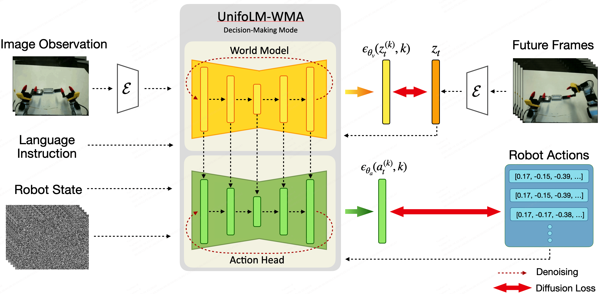
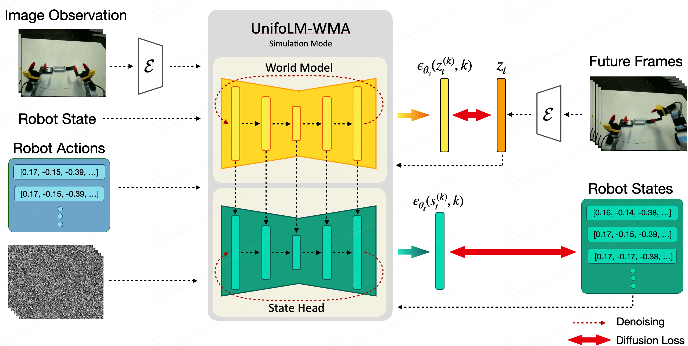

# UnifoLM-WMA-0: A World-Model-Action (WMA) Framework under UnifoLM Family
<p style="font-size: 1.2em;">
    <a href="https://unigen-x.github.io/unifolm-world-model-action.github.io"><strong>Project Page</strong></a> | 
    <a href="https://huggingface.co/collections/unitreerobotics/unifolm-wma-0-68ca23027310c0ca0f34959c"><strong>Models</strong></a> |
    <a href="https://huggingface.co/unitreerobotics/datasets"><strong>Dataset</strong></a> 
  </p>
<div align="center">
  <p align="right">
    <span> 🌎English </span> | <a href="README_cn.md"> 🇨🇳中文 </a>
  </p>
</div>
<div align="justify">
    <b>UnifoLM-WMA-0</b> is Unitree‘s open-source world-model–action architecture spanning multiple types of robotic embodiments, designed specifically for general-purpose robot learning. Its core component is a world-model capable of understanding the physical interactions between robots and the environments. This world-model provides two key functions: (a) <b>Simulation Engine</b> – operates as an interactive simulator to generate synthetic data for robot learning; (b) <b>Policy Enhancement</b> – connects with an action head and, by predicting future interaction processes with the world-model, further optimizes decision-making performance.
</div>

## 🦾 Real-Robot Demonstrations
|  |  |
|:---:|:---:|
|  |  |

**Note: the top-right window shows the world model’s pretion of future action videos.**

## 🔥 News

* Sep 22, 2025: 🚀 We released the deployment code for assisting experiments with [Unitree](https://www.unitree.com/) robots.
* Sep 15, 2025: 🚀 We released the training and inference code along with the model weights of [**UnifoLM-WMA-0**](https://huggingface.co/collections/unitreerobotics/unifolm-wma-0-68ca23027310c0ca0f34959c).

## 📑 Opensource Plan
- [x] Training 
- [x] Inference
- [x] Checkpoints
- [x] Deployment

## ⚙️  Installation
```
conda create -n unifolm-wma python==3.10.18
conda activate unifolm-wma

conda install pinocchio=3.2.0 -c conda-forge -y
conda install ffmpeg=7.1.1 -c conda-forge

git clone --recurse-submodules https://github.com/unitreerobotics/unifolm-world-model-action.git

# If you already downloaded the repo:
cd unifolm-world-model-action
git submodule update --init --recursive

pip install -e .

cd external/dlimp
pip install -e .
```
## 🧰 Model Checkpoints
| Model | Description | Link|
|---------|-------|------|
|$\text{UnifoLM-WMA-0}_{Base}$| Fine-tuned on [Open-X](https://robotics-transformer-x.github.io/) dataset. | [HuggingFace](https://huggingface.co/unitreerobotics/UnifoLM-WMA-0-Base)|
|$\text{UnifoLM-WMA-0}_{Dual}$| Fine-tuned on five [Unitree opensource dataset](https://huggingface.co/collections/unitreerobotics/g1-dex1-datasets-68bae98bf0a26d617f9983ab) in both decision-making and simulation modes. | [HuggingFace](https://huggingface.co/unitreerobotics/UnifoLM-WMA-0-Dual)|

## 🛢️ Dataset
In our experiments, we consider the following three opensource dataset:
| Dataset | Robot | Link |
|---------|-------|------|
|Z1_StackBox| [Unitree Z1](https://www.unitree.com/z1)|[Huggingface](https://huggingface.co/datasets/unitreerobotics/Z1_StackBox_Dataset/tree/v2.1)|
|Z1_DualArm_StackBox|[Unitree Z1](https://www.unitree.com/z1)|[Huggingface](https://huggingface.co/datasets/unitreerobotics/Z1_Dual_Dex1_StackBox_Dataset/tree/v2.1)|
|Z1_DualArm_StackBox_V2|[Unitree Z1](https://www.unitree.com/z1)|[Huggingface](https://huggingface.co/datasets/unitreerobotics/Z1_Dual_Dex1_StackBox_Dataset_V2/tree/v2.1)|
|Z1_DualArm_Cleanup_Pencils|[Unitree Z1](https://www.unitree.com/z1)|[Huggingface](https://huggingface.co/datasets/unitreerobotics/Z1_Dual_Dex1_CleanupPencils_Dataset/tree/v2.1)|
|G1_Pack_Camera|[Unitree G1](https://www.unitree.com/g1)|[Huggingface](https://huggingface.co/datasets/unitreerobotics/G1_Dex1_MountCameraRedGripper_Dataset/tree/v2.1)|
|G1_Dex1_DiverseManip_DualArm_256x256|[Unitree G1](https://www.unitree.com/g1)|[Huggingface](https://huggingface.co/datasets/unitreerobotics/G1_Dex1_DiverseManip_DualArm_256x256)|
|G1_Dex1_DiverseManip_DualArm_128x128|[Unitree G1](https://www.unitree.com/g1)|[Huggingface](https://huggingface.co/datasets/unitreerobotics/G1_Dex1_DiverseManip_DualArm_128x128)|
|G1_Dex1_DiverseManip_SingleArm_256x256|[Unitree G1](https://www.unitree.com/g1)|[Huggingface](https://huggingface.co/datasets/unitreerobotics/G1_Dex1_DiverseManip_SingleArm_256x256)|
|G1_Dex1_DiverseManip_SingleArm_128x128|[Unitree G1](https://www.unitree.com/g1)|[Huggingface](https://huggingface.co/datasets/unitreerobotics/G1_Dex1_DiverseManip_SingleArm_128x128)|

To train on your own dataset, first to have the data following the [Huggingface LeRobot V2.1](https://github.com/huggingface/lerobot) dataset format. Assume the dataset’s source directory structure is as follows:
```
source_dir/
    ├── dataset1_name
    ├── dataset2_name
    ├── dataset3_name
    └── ...
```
Then, convert a dataset to the required format using the command below:
```python
cd prepare_data
python prepare_training_data.py \
    --source_dir /path/to/your/source_dir \
    --target_dir /path/to/save/the/converted/data \
    --dataset_name "dataset1_name" \
    --robot_name "a tag of the robot in the dataset" # e.g, Unitree Z1 Robot Arm or Unitree G1 Robot with Gripper.
```
The resulting data structure (Note: model training only supports input from the main-view camera. If the dataset includes multiple views, remove the corresponding values from the ```data_dir``` column in the CSV file.
```
target_dir/
    ├── videos
    │     ├──dataset1_name
    │     │   ├──camera_view_dir
    │     │       ├── 0.mp4
    │     │       ├── 1.mp4
    │     │       └── ...
    │     └── ...
    ├── transitions
    │    ├── dataset1_name
    │        ├── meta_data
    │        ├── 0.h5
    │        ├── 1.h5
    │        └── ...
    └──  dataset1_name.csv
```
## 🚴‍♂️ Training
A. Our training strategy is outlined as follows:
- **Step 1**: Fine-tune a video generation model as the world model using the [Open-X](https://robotics-transformer-x.github.io/) dataset;
- **Step 2**: Post-train $\text{UnifoLM-WMA}$ in decision-making mode on the downstream task dataset;
  <div align="left">
      
  </div>
- **Step 3**: Post-train $\text{UnifoLM-WMA}$ in simulation mode on the downstream task dataset.
  <div align="left">
      
  </div>
**Note**: If you only require $\text{UnifoLM-WMA}$ to operate in a single mode, you may skip the corresponding step.

B. To conduct training on a single or multiple datasets, please follow the steps below:
- **Step 1**: The maximum DoF is assumed to be 16, if you have more than 16 DoF, update ```agent_state_dim``` and ```agent_action_dim``` in [configs/train/config.yaml](https://github.com/unitreerobotics/unifolm-wma/blob/working/configs/train/config.yaml) ;
- **Step 2**: Set up the input shapes for each modality in [configs/train/meta.json](https://github.com/unitreerobotics/unitree-world-model/blob/main/configs/train/meta.json);
- **Step 3**: Configure the training parameters in [configs/train/config.yaml](https://github.com/unitreerobotics/unitree-world-model/blob/main/configs/train/config.yaml). For the ```pretrained_checkpoint```, we recommend using the checkpoint " $\text{UnifoLM-WMA-0}_{Base}$ " fine-tuned on the [Open-X](https://robotics-transformer-x.github.io/) dataset;
  ```yaml
  model:
      pretrained_checkpoint: /path/to/pretrained/checkpoint;
      ...
      decision_making_only: True # Train the world model only in decision-making mode. If False, jointly train it in both decision-making and simulation modes.
      ...
  data:
      ...
      train:
          ...
          data_dir: /path/to/training/dataset/directory
      dataset_and_weights: # list the name of each dataset below and make sure the summation of weights is 1.0
          dataset1_name: 0.2
          dataset2_name: 0.2
          dataset3_name: 0.2
          dataset4_name: 0.2
          dataset5_name: 0.2
  ```
- **Step 4**: Setup ```experiment_name```, ```save_root``` variables in [scripts/train.sh](https://github.com/unitreerobotics/unitree-world-model/blob/main/scripts/train.sh);
- **Step 5**: Launch the training with the command:
```
bash scripts/train.sh
```
## 🌏 Inference under Interactive Simulation Mode
To run the world model in an interactive simulation mode, follow these steps:
- **Step 1**: (Skip this step if you just would like to test using the examples we provided) Prepare your own prompt following the format used in the [examples/world_model_interaction_prompts](https://github.com/unitreerobotics/unitree-world-model/tree/main/examples/world_model_interaction_prompts):
  ```
  world_model_interaction_prompts/
    ├── images
    │    ├── dataset1_name
    │    │       ├── 0.png     # Image prompt
    │    │       └── ...
    │    └── ...
    ├── transitions
    │    ├── dataset1_name
    │    │       ├── meta_data # Used for normalization
    │    │       ├── 0.h       # Robot state and action data; in interaction mode,
    │    │       │             # only used to retrieve the robot state corresponding 
    │    │       │             # to the image prompt
    │    │       └── ...
    │    └── ...
    ├──  dataset1_name.csv     # File for loading image prompts, text instruction and corresponding robot states
    └── ...
  ```
- **Step 2**: Specify the correct paths for ```pretrained_checkpoint```(e.g, $\text{UnifoLM-WMA-0}_{Dual}$) and ```data_dir``` in [configs/inference/world_model_interaction.yaml](https://github.com/unitreerobotics/unitree-world-model/blob/main/configs/inference/world_model_interaction.yaml) 
- **Step 3**: Set the paths for ```checkpoint```, ```res_dir``` and ```prompt_dir``` in [scripts/run_world_model_interaction.sh](https://github.com/unitreerobotics/unitree-world-model/blob/main/scripts/run_world_model_interaction.sh), and specify all the dataset's name in ```datasets=(...)```. Then, launch the inference with the command:
    ```
    bash scripts/run_world_model_interaction.sh
    ```

## 🧠 Inference and Deployment under Decision-Making Mode

In this setup, inference is performed on a server, while a robot client gathers observations from the real-robot and sends them to the server to query actions. The process unfolds through the following steps:

### Server Setup:
- **Step-1**: Specify ```ckpt```, ```res_dir```, ```datasets``` in [scripts/run_real_eval_server.sh](https://github.com/unitreerobotics/unifolm-world-model-action/blob/main/scripts/run_real_eval_server.sh);
- **Step-2**: Configure ```data_dir``` and ```dataset_and_weights``` in [config/inference/world_model_decision_making.yaml](https://github.com/unitreerobotics/unifolm-world-model-action/blob/f12b4782652ca00452941d851b17446e4ee7124a/configs/inference/world_model_decision_making.yaml#L225);
- **Step-3**: Launch the server:
```
conda activate unifolm-wma
cd unifolm-world-model-action
bash scripts/run_real_eval_server.sh
```

### Client Setup
- **Step-1**: Follow the instructions in [unitree_deploy/README.md](https://github.com/unitreerobotics/unifolm-world-model-action/blob/main/unitree_deploy/README.md) to create the ```unitree_deploy``` conda environment, install the required packages, launch the controllers or services on the real-robot.
- **Step-2**: Open a new terminal and establish a tunnel connection from the client to the server:
```
ssh user_name@remote_server_IP -CNg -L 8000:127.0.0.1:8000
```
- **Step-3**: Run the ```unitree_deploy/robot_client.py``` script to start inference:
```
cd unitree_deploy
python scripts/robot_client.py --robot_type "g1_dex1" --action_horizon 16 --exe_steps 16 --observation_horizon 2 --language_instruction "pack black camera into box" --output_dir ./results --control_freq 15
```

## 📝 Codebase Architecture
Here's a high-level overview of the project's code structure and core components:
```
unitree-world-model/
    ├── assets                      # Media assets such as GIFs, images, and demo videos
    ├── configs                     # Configuration files for training and inference
    │    ├── inference
    │    └──  train
    ├── examples                    # Example inputs and prompts for running inference
    ├── external                    # External packages
    ├── prepare_data                # Scripts for dataset preprocessing and format conversion
    ├── scripts                     # Main scripts for training, evaluation, and deployment
    ├── src
    │    ├──unitree_worldmodel      # Core Python package for the Unitree world model
    │    │      ├── data            # Dataset loading, transformations, and dataloaders
    │    │      ├── models          # Model architectures and backbone definitions
    │    │      ├── modules         # Custom model modules and components
    │    │      └──  utils          # Utility functions and common helpers
    └── unitree_deploy              # Deployment code
```

## 🙏 Acknowledgement
Lots of code are inherited from [DynamiCrafter](https://github.com/Doubiiu/DynamiCrafter), [Diffusion Policy](https://github.com/real-stanford/diffusion_policy), [ACT](https://github.com/MarkFzp/act-plus-plus) and [HPT](https://github.com/liruiw/HPT).

## 📝 Citation
```
@misc{unifolm-wma-0,
  author       = {Unitree},
  title        = {UnifoLM-WMA-0: A World-Model-Action (WMA) Framework under UnifoLM Family},
  year         = {2025},
}
```
