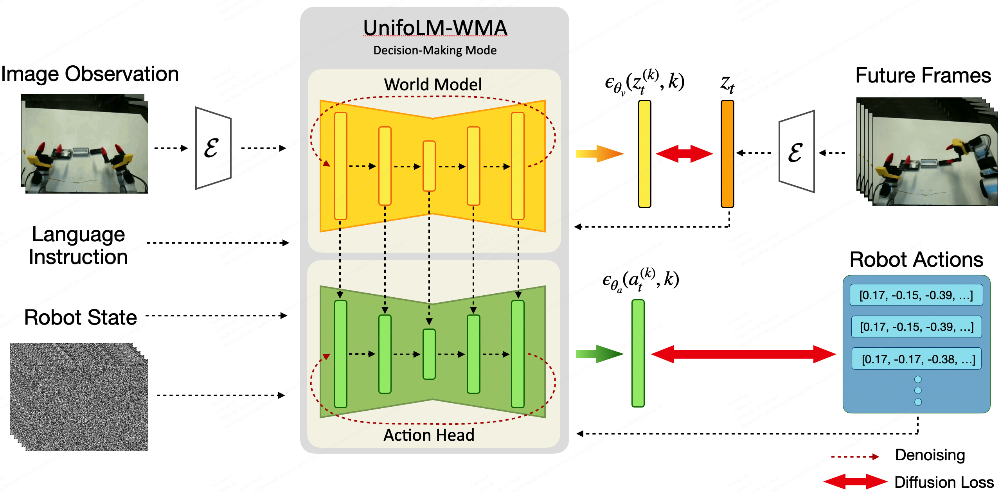
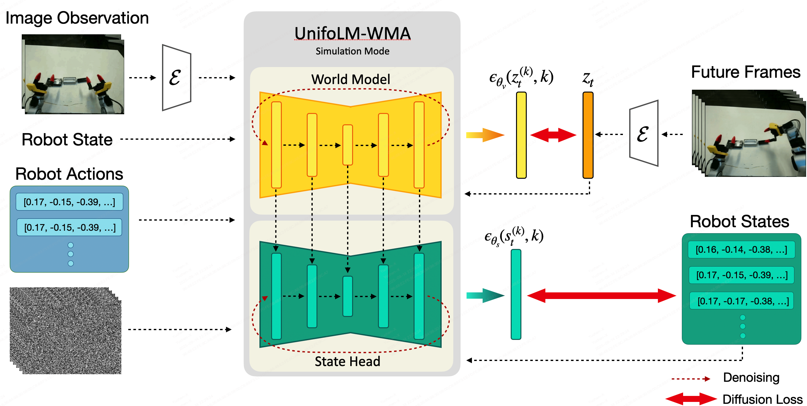

# UnifoLM-WMA-0: A World-Model-Action (WMA) Framework under UnifoLM Family
 <p style="font-size: 1.2em;">
    <a href="https://unigen-x.github.io/unifolm-world-model-action.github.io"><strong>项目主页</strong></a> | 
    <a href="https://huggingface.co/collections/unitreerobotics/unifolm-wma-0-68ca23027310c0ca0f34959c"><strong>开源模型</strong></a> |
    <a href="https://huggingface.co/unitreerobotics/datasets"><strong>开源数据</strong></a> 
  </p>
<div align="center">
  <p align="right">
    <span> 🌎English </span> | <a href="README_cn.md"> 🇨🇳中文 </a>
  </p>
</div>

**UnifoLM-WMA-0** 是宇树科技跨多类机器人本体的开源世界模型-动作架构，专为通用机器人学习而设计。其核心成分在于一个可以理解机器人与环境交互物理规律的世界模型。该世界模型具备两大核心功能：（1）**仿真引擎**，作为交互式仿真器运行，为机器人学习提供合成数据;（2）**策略增强**，可与一个动作头进行对接，通过预测未来与物理世界的交互过程，进一步优化决策性能。模型的真机部署效果如下所示，其中右上角小窗口是世界模型对于未来环境变化的预测，可辅助控制指令生成。

## 🦾 真机效果 

|  |  |
|:---:|:---:|
|  |  |

**注：右上角小窗口显示世界模型对未来动作视频的预测。**

## 新闻
* 2025年9月15日: 🚀 我们发布了 **UnifoLM-WMA-0** 的训练与推理代码，以及对应的模型权重.


## 📑 开源计划
- [x] 训练代码 
- [x] 推理代码 
- [x] 模型Checkpoints
- [x] 真机部署代码

## ⚙️  安装
```
conda create -n unifolm-wma python==3.10.18
conda activate unifolm-wma

conda install pinocchio=3.2.0 -c conda-forge -y
conda install ffmpeg=7.1.1 -c conda-forge

git clone --recurse-submodules https://github.com/unitreerobotics/unifolm-world-model-action.git

# If you already downloaded the repo:
cd unifolm-world-model-action
git submodule update --init --recursive

pip install -e .

cd external/dlimp
pip install -e .
```
## 🧰 模型 Checkpoints
| 模型 | 描述 | 链接 |
|---------|-------|------|
|$\text{UnifoLM-WMA-0}_{Base}$| 在 [Open-X](https://robotics-transformer-x.github.io/) 数据集微调后的模型 | [HuggingFace](https://huggingface.co/unitreerobotics/UnifoLM-WMA-0-Base)|
|$\text{UnifoLM-WMA-0}_{Dual}$| 在五个[宇树科技开源数据集](https://huggingface.co/collections/unitreerobotics/g1-dex1-datasets-68bae98bf0a26d617f9983ab)上，决策和仿真双模式，联合微调后的模型 | [HuggingFace](https://huggingface.co/unitreerobotics/UnifoLM-WMA-0-Dual)|

## 🛢️ 数据集
实验中，我们训练测试了如下五个开源数据集：
| 数据集 | 机器人 | 链接 |
|---------|-------|------|
|Z1_StackBox| [Unitree Z1](https://www.unitree.com/z1)|[Huggingface](https://huggingface.co/datasets/unitreerobotics/Z1_StackBox_Dataset/tree/v2.1)|
|Z1_DualArm_StackBox|[Unitree Z1](https://www.unitree.com/z1)|[Huggingface](https://huggingface.co/datasets/unitreerobotics/Z1_Dual_Dex1_StackBox_Dataset/tree/v2.1)|
|Z1_DualArm_StackBox_V2|[Unitree Z1](https://www.unitree.com/z1)|[Huggingface](https://huggingface.co/datasets/unitreerobotics/Z1_Dual_Dex1_StackBox_Dataset_V2/tree/v2.1)|
|Z1_DualArm_Cleanup_Pencils|[Unitree Z1](https://www.unitree.com/z1)|[Huggingface](https://huggingface.co/datasets/unitreerobotics/Z1_Dual_Dex1_CleanupPencils_Dataset/tree/v2.1)|
|G1_Pack_Camera|[Unitree G1](https://www.unitree.com/g1)|[Huggingface](https://huggingface.co/datasets/unitreerobotics/G1_Dex1_MountCameraRedGripper_Dataset/tree/v2.1)|

要在自定义数据集上训练，请首先确保数据符合 [Huggingface LeRobot V2.1](https://github.com/huggingface/lerobot)  数据集格式，假设下载后的数据目录结构如下：
```
source_dir/
    ├── dataset1_name
    ├── dataset2_name
    ├── dataset3_name
    └── ...
```
随后执行以下命令进行格式转换:
```python
cd prepare_data
python prepare_training_data.py \
    --source_dir /path/to/your/source_dir \
    --target_dir /path/to/save/the/converted/data/directory \
    --dataset_name "dataset1_name" \
    --robot_name "a tag of the robot in the dataset" # 例如： Unitree Z1 Robot Arm 或 Unitree G1 Robot with Gripper。
```
转换后的数据结构如下（注：模型训练只支持主视角相机输入， 如数据存在腕部视角，需删除CSV文件中```data_dir```列对应的视频路径）：
```
target_dir/
    ├── videos
    │     ├──dataset1_name
    │     │   ├──camera_view_dir
    │     │       ├── 0.mp4
    │     │       ├── 1.mp4
    │     │       └── ...
    │     └── ...
    ├── transitions
    │    ├── dataset1_name
    │    │   ├── meta_data
    │    │   ├── 0.h5
    │    │   ├── 1.h5
    │    │   └── ...
    │    └── ...
    └──  dataset1_name.csv
```
## 🚴 ♂️ 模型训练
一. 我们的训练策略概括如下：
- **步骤 1**：在 [Open-X](https://robotics-transformer-x.github.io/) 数据集上微调视频生成模型，使其作为世界模型（World Model）；
- **步骤 2**：在下游任务数据集上，对 $\text{UnifoLM-WMA}$ 进行决策模式（decision-making mode）后训练；
  <div align="left">
   
  </div>
- **步骤 3**：在下游任务数据集上，对 $\text{UnifoLM-WMA}$ 进行仿真模式（simulation mode）后训练。
  <div align="left">
   
  </div>
**注意**：如果只需要 $\text{UnifoLM-WMA}$ 在单一模式下运行，可以跳过相应的步骤。

二. 在单个或多个数据集上进行训练，请按照以下步骤操作：
- **步骤1**：默认的最高自由度为16DOF，若需更多自由度，请修改[configs/train/config.yaml](https://github.com/unitreerobotics/unifolm-wma/blob/working/configs/train/config.yaml) 中 ```agent_state_dim``` 及 ```agent_action_dim``` 的数值；
- **步骤2**：在 [configs/train/meta.json](https://github.com/unitreerobotics/unitree-world-model/blob/main/configs/train/meta.json) 中为每种模态设置输入维度；
- **步骤3**： 在 [configs/train/config.yaml](https://github.com/unitreerobotics/unitree-world-model/blob/main/configs/train/config.yaml) 中配置训练参数及路径。关于预训练的模型，推荐使用 $\text{UnifoLM-WMA-0}_{Base}$ ，其在[Open-X](https://robotics-transformer-x.github.io/) 数据集上微调过；
  ```yaml
  model:
      pretrained_checkpoint: /path/to/pretrained/checkpoint
      ...
      dicision_making_only: True # 是否只训练世界模型决策模式？如果否，则决策模式与仿真模式联合训练。
      ...
  data:
      ...
      train:
          ...
          data_dir: /path/to/training/dataset/directory
      dataset_and_weights: # 列出所有数据集的名称及权重，确保权重和为1.0
          dataset1_name: 0.2
          dataset2_name: 0.2
          dataset3_name: 0.2
          dataset4_name: 0.2
          dataset5_name: 0.2
  ```
- **步骤4**： 在 [scripts/train.sh](https://github.com/unitreerobotics/unitree-world-model/blob/main/scripts/train.sh) 中配置```experiment_name```, ```save_root``` 变量；
- **步骤5**： 运行如下指令开启训练：
```
bash scripts/train.sh
```
## 🌏 世界模型交互推理
要启用世界模型的交互模式，请按以下步骤操作：
- **步骤1**：(若仅用提供的实例进行测试，可跳过此步) 请按照 [examples/world_model_interaction_prompts](https://github.com/unitreerobotics/unitree-world-model/tree/main/examples/world_model_interaction_prompts) 目录中的格式，自定义提示词目录：
```
world_model_interaction_prompts/
    ├── images
    │    ├── dataset1_name
    │    │       ├── 0.png     # 图像提示词
    │    │       └── ...
    │    └── ...
    ├── transitions
    │    ├── dataset1_name
    │    │       ├── meta_data # 用于归一化
    │    │       ├── 0.h       # 机器人状态、动作相关数据，在交互模式下仅用于获取与图像提示词对应的机器人状态
    │    │       └── ...
    │    └── ...
    ├──  dataset1_name.csv     # 该文件用于加载对应的：图像提示词、文本指令及机器人状态
    └── ...
```
- **步骤2**： 在 [configs/inference/world_model_interaction.yaml](https://github.com/unitreerobotics/unitree-world-model/blob/main/configs/inference/world_model_interaction.yaml) 中指定 ```pretrained_checkpoint``` (例如：$\text{UnifoLM-WMA-0}_{Dual}$) 和 ```data_dir``` 的正确路径；
- **步骤3**： 在 [scripts/run_world_model_interaction.sh](https://github.com/unitreerobotics/unitree-world-model/blob/main/scripts/run_world_model_interaction.sh) 中指定```checkpoint```、```res_dir``` 和 ```prompt_dir```的正确路径，并在```datasets=(...)```中列出测试的数据集名称，然后用下述指令启动推理:
    ```
    bash scripts/run_world_model_interaction.sh
    ```
  
## 🧠 世界模型决策推理及部署
在我们的系统中，推理在服务器端执行；机器人客户端从真实机器人收集观测信息并发送至服务器, 进行视频及动作推理。可通过如下步骤实现整个过程：

### 服务器端设置
- **步骤1**： 在 [scripts/run_real_eval_server.sh](https://github.com/unitreerobotics/unifolm-world-model-action/blob/main/scripts/run_real_eval_server.sh) 中指定 ```ckpt```、```res_dir```、```datasets```;
- **步骤2**： 在 [config/inference/world_model_decision_making.yaml](https://github.com/unitreerobotics/unifolm-world-model-action/blob/f12b4782652ca00452941d851b17446e4ee7124a/configs/inference/world_model_decision_making.yaml#L225) 中配置 ```data_dir``` 和 ```dataset_and_weights```;
- **步骤3**： 启动服务器：
```
conda activate unifolm-wma
cd unifolm-world-model-action
bash scripts/run_real_eval_server.sh
```

### 客户端设置
- **步骤1**： 参考 [unitree_deploy/README.md](https://github.com/unitreerobotics/unifolm-world-model-action/blob/main/unitree_deploy/README.md)，创建 ```unitree_deploy``` conda 环境，安装所需依赖包，并在真实机器人端启动控制器或服务;
- **步骤2**: 打开一个新的终端，从客户端到服务器建立隧道连接：
```
ssh user_name@remote_server_IP -CNg -L 8000:127.0.0.1:8000
```
- **步骤3**： 运行 ```unitree_deploy/robot_client.py``` 脚本以启动推理：
```
cd unitree_deploy
python scripts/robot_client.py --robot_type "g1_dex1" --action_horizon 16 --exe_steps 16 --observation_horizon 2 --language_instruction "pack black camera into box" --output_dir ./results --control_freq 15
```

## 📝 代码架构
以下是本项目代码结构设计及核心组件说明：：
```
unitree-world-model/
    ├── assets                      # GIF动图、静态图片和演示视频等媒体素材
    ├── configs                     # 配置文件
    │    ├── inference
    │    └──  train
    ├── examples                    # 示例数据
    ├── external                    # 外部代码库
    ├── prepare_data                # 数据处理
    ├── scripts                     # 主程序脚本
    ├── src
    │    ├──unitree_worldmodel      # 核心库
    │    │      ├── data            # 数据加载
    │    │      ├── models          # 模型架构
    │    │      ├── modules         # 自定义模块
    |    │      └──  utils          # 工具函数
```

## 🙏 致谢声明
本项目代码基于以下优秀开源项目构建，特此致谢：[DynamiCrafter](https://github.com/Doubiiu/DynamiCrafter), [Diffusion Policy](https://github.com/real-stanford/diffusion_policy), [ACT](https://github.com/MarkFzp/act-plus-plus) 和 [HPT](https://github.com/liruiw/HPT).
